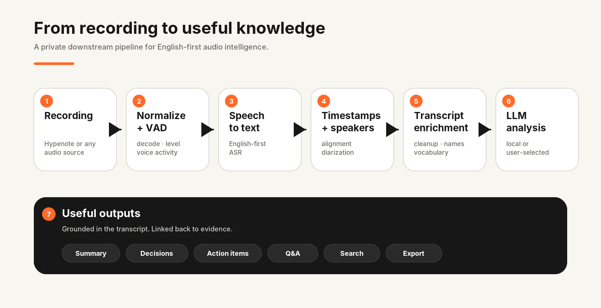
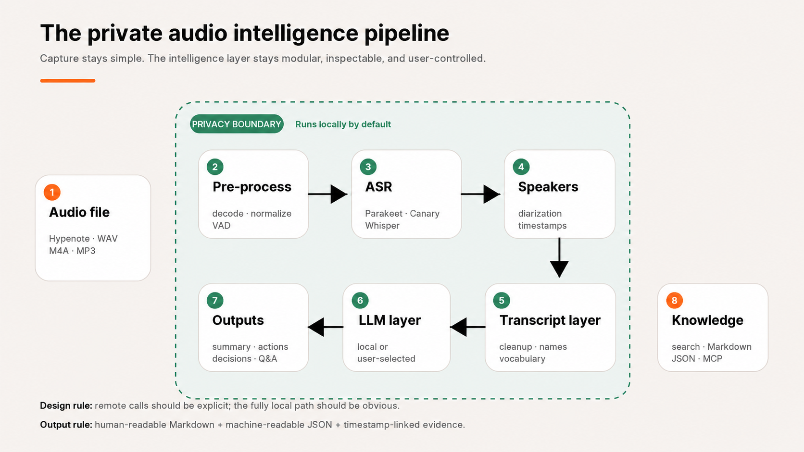

<div align="center">
<a href="https://hypenote.ai" target="_blank">
  
</a>

## 🟠 Awesome Private Audio Intelligence 🟠

### English-first, privacy-first pipelines for  
### **audio → transcription → diarization → LLM analysis → useful notes**

[](https://hypenote.ai/)
[](#what-we-optimize-for)
[](#what-we-optimize-for)
[](#the-pipeline)
[](CONTRIBUTING.md)

**A practical map of repositories worth studying if you want to turn private audio into searchable transcripts, summaries, decisions, action items, and AI-ready knowledge.**

[Explore the top 10](#top-10-projects) ·
[Compare architectures](#quick-comparison) ·
[See the Hypenote pipeline](#hypenote-reference-pipeline-work-in-progress) ·
[Add a project](CONTRIBUTING.md)

</div>

---

## Why this list exists

A good recorder should not force you into one transcription cloud.

**Hypenote** is designed around the opposite idea: capture the conversation well, keep ownership of the recording, and let the user choose what happens next.

You can learn more about **Hypenote** at https://hypenote.ai, 
or support us on Kickstarter (launching soon) by joining the waiting list:

<a href="[https://www.kickstarter.com/projects/ermit/hypenote-a-smart-voice-recorder-for-your-ai-workflows]" target="_blank">
  
</a>


This repository explores the best existing codebases for the downstream pipeline:




The focus is deliberately **English-first** and **privacy-first**. Multilingual support is a bonus, but projects rank higher here when they give us strong English ASR choices, local processing, good speaker handling, flexible LLM integration, and reusable architecture.

> **This is not a pure popularity ranking.** It is an engineering-oriented shortlist for people building or evaluating a complete private audio intelligence pipeline.

---

## The pipeline



### What we optimize for

| Criterion | What we look for |
|---|---|
| 🇬🇧 **English transcription** | Modern ASR choices, good long-form behavior, timestamps, vocabulary controls |
| 🔒 **Privacy** | Local/on-device/self-hosted by default; remote services are optional |
| 👥 **Speaker handling** | Diarization, channel separation, speaker attribution, or voice profiles |
| 🧠 **LLM flexibility** | Ollama/local models and/or OpenAI-compatible endpoints; custom prompts |
| 📦 **End-to-end completeness** | Audio ingestion through structured notes, not just a Whisper wrapper |
| 🛠️ **Reusability** | Clear code, APIs, modular services, useful architecture for builders |
| 📚 **Maturity** | Documentation, releases, community activity, tests, sensible deployment |
| ⚖️ **License clarity** | MIT/Apache are easiest to study and reuse; copyleft/source-available projects are flagged |

---

# Top 10 projects

## 1. 🥇 Meetily

**Repository:** [Zackriya-Solutions/meetily](https://github.com/Zackriya-Solutions/meetily)

[](https://github.com/Zackriya-Solutions/meetily)
[](https://github.com/Zackriya-Solutions/meetily)
[](https://github.com/Zackriya-Solutions/meetily)

**Why it is here:** probably the strongest all-round desktop reference for a privacy-first meeting assistant.

- Local transcription with **Whisper or NVIDIA Parakeet**
- Real-time meeting capture plus audio-file import
- Speaker diarization
- Local summaries through **Ollama**, with optional Claude / Groq / OpenRouter / OpenAI-compatible endpoints
- Rust + Tauri architecture
- macOS, Windows and Linux support
- **MIT**

**Best thing to study:** how capture, local inference, persistence, GPU acceleration, UI, and LLM summaries are packaged into one consumer-facing desktop application.

**Hypenote fit:** ⭐⭐⭐⭐⭐

---

## 2. 🥈 Scriberr

**Repository:** [rishikanthc/Scriberr](https://github.com/rishikanthc/Scriberr)

[](https://github.com/rishikanthc/Scriberr)
[](https://github.com/rishikanthc/Scriberr)
[](https://github.com/rishikanthc/Scriberr)

**Why it is here:** one of the best references for a **file-first** self-hosted workflow, which makes it especially relevant to a dedicated recorder.

- Audio and video ingestion
- Modern ASR options including **NVIDIA Parakeet, Canary and Whisper**
- Word-level timing
- Speaker diarization
- Summaries and transcript chat
- **Ollama** and OpenAI-compatible LLM providers
- REST API, Docker and CUDA support
- **MIT**

> ⚠️ **Maintenance note:** the maintainer currently states that active development is paused, not abandoned. Treat it as an excellent architecture/reference implementation, but check project status before depending on it operationally.

**Best thing to study:** clean separation between ingestion, transcription profiles, diarization, transcript UX, summarization templates, chat, API access and self-hosted deployment.

**Hypenote fit:** ⭐⭐⭐⭐⭐

---

## 3. 🥉 Nojoin

**Repository:** [Valtora/Nojoin](https://github.com/Valtora/Nojoin)

[](https://github.com/Valtora/Nojoin)
[](https://github.com/Valtora/Nojoin)
[](https://github.com/Valtora/Nojoin)

**Why it is here:** unusually complete on the **analysis/product layer**, not just STT.

- Self-hosted capture without a meeting bot
- Speaker attribution and speaker library
- AI-generated notes
- Meeting chat grounded in transcript + documents
- Talk-time / interruption / participation analytics
- Local AI option through **Ollama**
- Search, calendar context and task workspace
- **AGPL-3.0**

**Best thing to study:** what happens *after* transcription—how raw speech becomes a useful meeting workspace.

**Hypenote fit:** ⭐⭐⭐⭐☆

---

## 4. Vexa

**Repository:** [Vexa-ai/vexa](https://github.com/Vexa-ai/vexa)

[](https://github.com/Vexa-ai/vexa)
[](https://github.com/Vexa-ai/vexa)
[](https://github.com/Vexa-ai/vexa)

**Why it is here:** the strongest reference here for a **service/API + agent** architecture.

- Bots for Google Meet, Microsoft Teams, Zoom and Jitsi
- Real-time speaker-attributed transcripts
- Self-hosted **faster-whisper** transcription service
- Recordings in your own object storage
- Agent chat, routines and events over meeting knowledge
- Markdown / Git-oriented knowledge workspace
- Docker/Kubernetes deployment
- **Apache-2.0**

**Best thing to study:** turning transcription into an API product and feeding structured meeting knowledge into sandboxed agents.

**Hypenote fit:** ⭐⭐⭐☆☆ — less relevant for hardware ingestion, highly relevant architecturally.

---

## 5. Meeting Transcriber

**Repository:** [pasrom/meeting-transcriber](https://github.com/pasrom/meeting-transcriber)

[](https://github.com/pasrom/meeting-transcriber)
[](https://github.com/pasrom/meeting-transcriber)
[](https://github.com/pasrom/meeting-transcriber)

**Why it is here:** a very clean Apple-native implementation of the entire pipeline.

- Automatic meeting capture **and file import**
- **WhisperKit or Parakeet**
- Speaker diarization / recognition
- Custom vocabulary support
- Claude CLI, Ollama, LM Studio or OpenAI-compatible output generation
- Markdown protocol with summary, decisions, tasks and full transcript
- Real-model end-to-end tests
- **MIT**

**Best thing to study:** English-first on-device UX on Apple Silicon, including model choice, diarization, vocabulary and structured Markdown output.

**Hypenote fit:** ⭐⭐⭐⭐⭐ for macOS users.

---

## 6. Transcription Stream

**Repository:** [transcriptionstream/transcriptionstream](https://github.com/transcriptionstream/transcriptionstream)

[](https://github.com/transcriptionstream/transcriptionstream)
[](https://github.com/transcriptionstream/transcriptionstream)

**Why it is here:** a straightforward, inspectable example of the classic self-hosted pipeline.

- File upload and SSH drop zones
- Whisper / WhisperX-based transcription + diarization
- LLM summarization with **Ollama**
- Full-text search through Meilisearch
- Review/playback web UI
- Docker-based deployment
- **GPL-3.0**

> ⚠️ The project explicitly describes itself as example code and warns that production deployments need additional security hardening.

**Best thing to study:** a simple service decomposition for batch audio → transcript → summary → searchable archive.

**Hypenote fit:** ⭐⭐⭐⭐⭐

---

## 7. Millet

**Repository:** [pretyflaco/millet](https://github.com/pretyflaco/millet)

[](https://github.com/pretyflaco/millet)
[](https://github.com/pretyflaco/millet)
[](https://github.com/pretyflaco/millet)

**Why it is here:** a strong technical reference for high-quality post-processing.

- **WhisperX** transcription
- Word-level alignment
- **pyannote** speaker diarization
- Dual-channel meeting audio
- Local summaries through Ollama, plus configurable remote backends
- Structured meeting output and PDF generation
- **GPL-3.0**

**Best thing to study:** alignment + diarization + structured summarization as a post-recording pipeline.

**Hypenote fit:** ⭐⭐⭐⭐⭐

---

## 8. Scripta

**Repository:** [thehwang/Scripta](https://github.com/thehwang/Scripta)

[](https://github.com/thehwang/Scripta)
[](https://github.com/thehwang/Scripta)
[](https://github.com/thehwang/Scripta)

**Why it is here:** small, understandable and genuinely local.

- Native macOS dual-channel capture
- **whisper.cpp** for microphone speech
- Apple on-device speech recognition for system audio
- Local summaries and chat through **Ollama**
- Strong attention to long-context summarization behavior
- No cloud required
- **MIT**

**Best thing to study:** compact native implementation and the practical failure modes of local LLM summarization over long transcripts.

**Hypenote fit:** ⭐⭐⭐⭐☆

---

## 9. Loqui

**Repository:** [joaquingit1/loqui](https://github.com/joaquingit1/loqui)

[](https://github.com/joaquingit1/loqui)
[](https://github.com/joaquingit1/loqui)
[](https://github.com/joaquingit1/loqui)

**Why it is here:** an interesting newer design for local meeting memory.

- Real-time dual-stream transcription
- On-device diarization
- AI chat and post-meeting summaries
- Plain Markdown transcripts
- Local read-only **MCP server** for agents
- Local/native or bring-your-own-key AI
- **MIT**

**Best thing to study:** treating the transcript as durable, user-owned memory that other AI agents can query without modifying the source transcript.

**Hypenote fit:** ⭐⭐⭐⭐☆

> 🧪 Newer project. Excellent ideas; validate maturity before adopting components wholesale.

---

## 10. screenpipe

**Repository:** [dp466/screenpipe](https://github.com/dp466/screenpipe)

[](https://github.com/dp466/screenpipe)
[](https://github.com/dp466/screenpipe)

**Why it is here:** not a dedicated recorder-to-notes app, but one of the most useful references for **local multimodal memory + agent workflows**.

- System + microphone audio capture
- Local **Whisper Large-V3-Turbo**
- Speaker identification / diarization
- Local SQLite storage
- AI search
- Meeting-summary automation
- MCP + REST API + programmable “pipes”
- Local Ollama / OpenAI-compatible models

> ⚠️ **License caution:** current source is source-available for personal/non-commercial use; commercial use requires license review. Treat this primarily as an architecture reference for a commercial product.

**Best thing to study:** permissioned AI access to local captured data, agent automation, search, and long-lived personal knowledge.

**Hypenote fit:** ⭐⭐⭐☆☆ as a direct pipeline; ⭐⭐⭐⭐⭐ as an architecture reference.

---

# Quick comparison

Legend: ✅ strong/native · 🟡 available/partial/architecture-dependent · ❌ not the focus

| Project | Audio files | Local STT | English-first options | Speakers | LLM summary / analysis | Local LLM | API / automation | License |
|---|:---:|:---:|:---:|:---:|:---:|:---:|:---:|---|
| **Meetily** | ✅ | ✅ | ✅ Parakeet / Whisper | ✅ | ✅ | ✅ | 🟡 | MIT |
| **Scriberr** | ✅ | ✅ | ✅ Parakeet / Canary / Whisper | ✅ | ✅ | ✅ | ✅ | MIT |
| **Nojoin** | 🟡 | ✅ | ✅ | ✅ | ✅ notes/chat/analytics | ✅ | ✅ | AGPL-3.0 |
| **Vexa** | 🟡 | ✅ | ✅ faster-whisper | ✅ | ✅ agents | ✅ / BYO | ✅✅ | Apache-2.0 |
| **Meeting Transcriber** | ✅ | ✅ | ✅ Parakeet / WhisperKit | ✅ | ✅ | ✅ | 🟡 | MIT |
| **Transcription Stream** | ✅ | ✅ | ✅ Whisper family | ✅ | ✅ | ✅ | 🟡 | GPL-3.0 |
| **Millet** | ✅ | ✅ | ✅ WhisperX | ✅ | ✅ | ✅ | 🟡 | GPL-3.0 |
| **Scripta** | 🟡 | ✅ | ✅ whisper.cpp / Apple Speech | 🟡 channel split | ✅ | ✅ | ❌ | MIT |
| **Loqui** | 🟡 | ✅ | ✅ faster-whisper | ✅ | ✅ | ✅ | ✅ MCP | MIT |
| **screenpipe** | 🟡 | ✅ | ✅ Whisper Large-V3-Turbo | ✅ | ✅ agents | ✅ | ✅✅ | Source-available |

---

# Which repository should I inspect first?

### I have Hypenote audio files and want a working self-hosted app
Start with **Scriberr**, **Meeting Transcriber**, **Millet**, and **Transcription Stream**.

### I want the strongest cross-platform desktop product reference
Start with **Meetily**.

### I care most about meeting intelligence after transcription
Study **Nojoin**.

### I am designing an API, team service, or agent platform
Study **Vexa**.

### I am building Apple-native on-device processing
Study **Meeting Transcriber** and **Scripta**.

### I want searchable long-term AI memory
Study **Loqui**, **Vexa**, and **screenpipe**.

---

# 🇬🇧 English-first implementation notes

For English recordings, the most interesting repositories above expose three useful ASR families:

| ASR family | Why it is interesting for Hypenote |
|---|---|
| **NVIDIA Parakeet** | Fast modern option used by Meetily and Meeting Transcriber; worth benchmarking on conversational English |
| **NVIDIA Canary** | Available in Scriberr; useful second engine to benchmark on English and domain-specific speech |
| **Whisper / faster-whisper / WhisperX / WhisperKit** | Broadest ecosystem; strong tooling for timestamps, alignment, diarization and hardware portability |

For a Hypenote reference implementation, do **not** hard-code one winner. Benchmark at least:

1. conversational meetings,
2. interviews,
3. lectures,
4. noisy rooms,
5. multiple English accents,
6. proper nouns / product names,
7. long recordings,
8. bookmarked moments.

Recommended quality metrics:

- Word Error Rate / normalized WER
- speaker-attribution error
- timestamp drift
- named-entity accuracy
- hallucination rate in silence/noise
- real-time factor
- peak RAM / VRAM
- summary factuality against the transcript

---

# Hypenote Reference Pipeline (work in progress)

> **Status:** 🚧 design / implementation in progress  
> **Goal:** a simple, opinionated, local-first reference pipeline for recordings created with [Hypenote](https://hypenote.ai/).

The proposed implementation will live in [`hypenote-pipeline/`](hypenote-pipeline/).

### Design principles

- **File-first.** A recording is the source of truth.
- **Local by default.** No cloud dependency for the core path.
- **English-first.** Defaults tuned and benchmarked for English conversations.
- **Model-swappable.** ASR, diarization and LLM layers expose clean interfaces.
- **Bookmark-aware.** Preserve Hypenote timestamps/bookmarks and surface them to the transcript and LLM.
- **Structured outputs.** Markdown for humans, JSON for machines.
- **Evidence-preserving.** Summaries should link back to transcript timestamps.
- **No forced subscription.** Users can run local models or configure providers they already trust.


### Suggested repository layout

```text
hypenote-pipeline/
├── ingest/             # local folder, NAS, WebDAV, S3-compatible adapters
├── audio/              # decoding, normalization, VAD
├── stt/                # ASR adapters
├── diarization/        # speaker segmentation / identification
├── transcript/         # timestamps, bookmarks, names, cleanup
├── analysis/           # LLM provider interface + structured extraction
├── prompts/            # versioned English prompts
├── schemas/            # JSON schemas for transcript/summary/actions
├── exports/            # Markdown / JSON / subtitles
├── benchmarks/         # English evaluation set + scoring scripts
└── README.md
```

---

# Other projects worth watching

These did not make the top 10 for this specific **full-pipeline + English-first + privacy-first** shortlist, but are worth exploring:

- [Higangssh/ghostmeet](https://github.com/Higangssh/ghostmeet) — simple Chrome-extension meeting capture + Whisper + summaries; diarization is still on the roadmap.
- [naxhq/NexQ](https://github.com/naxhq/NexQ) — local meeting/interview copilot with many STT and LLM providers.
- [royabes/sealscribe](https://github.com/royabes/sealscribe) — very new, but interesting privacy gateway with reversible PII redaction before LLM calls.
- [attendee-labs/attendee](https://github.com/attendee-labs/attendee) — mature universal meeting-bot API; great capture infrastructure, less focused on the full local summarization pipeline.
- [pluja/whishper](https://github.com/pluja/whishper) — mature self-hosted file transcription UI; excellent ingestion/transcription reference, but not primarily an LLM analysis product.
- [TsoTing-Li/Meeting-Assistant](https://github.com/TsoTing-Li/Meeting-Assistant) — interesting WhisperX + LLM transcript correction + custom dictionary + structured and cross-meeting summaries.

---

# A few architecture patterns worth borrowing

_Not code. Ideas._

### 1. Provider adapters everywhere
A clean `Transcriber`, `Diarizer` and `Analyzer` interface makes model benchmarking much easier.

### 2. Keep the transcript immutable
Let AI create derived notes, but preserve the raw timed transcript as evidence.

### 3. Separate capture from intelligence
Hypenote already gives us a clean boundary: **the recorder produces a file; the user's pipeline decides what to do with it.**

### 4. Produce machine-readable output first
Use JSON schemas for speakers, segments, decisions and action items; render Markdown/PDF afterward.

### 5. Treat bookmarks as first-class context
A physical bookmark during a conversation is a strong human signal. It should survive the entire pipeline and influence navigation, summarization and retrieval.

### 6. Make privacy visible in the architecture
Every remote call should be explicit. A fully local path should be obvious and easy to test.

---

# License notes

This repository is a **curated technical index**, not legal advice.

Before reusing code, dependencies, model weights or UI assets:

- verify the repository's current license,
- verify the license of model weights separately,
- check copyleft obligations (AGPL/GPL),
- check commercial-use restrictions,
- check attribution requirements,
- check whether optional cloud services change the privacy model.

This is especially important for **screenpipe**, whose current source license is not a standard permissive open-source license for commercial reuse.

---

# Contributing

Found a better project? Built a new pipeline? Have benchmark data?

Please open a PR or use the **Add a project** issue template.

A project is especially interesting when it has:

- local/self-hosted processing,
- audio-file ingestion,
- strong English transcription,
- diarization or channel separation,
- local-LLM support,
- structured summaries/action items,
- reproducible benchmarks,
- clear licensing.

See [CONTRIBUTING.md](CONTRIBUTING.md).

---

<div align="center">

## Your voice. Your device. Your data.

Built as an open technical resource around the philosophy behind **[Hypenote](https://hypenote.ai/)**.

<sub>Repository landscape reviewed: 20 August 2026. Project features and licenses evolve—always verify upstream before adopting.</sub>

</div>
